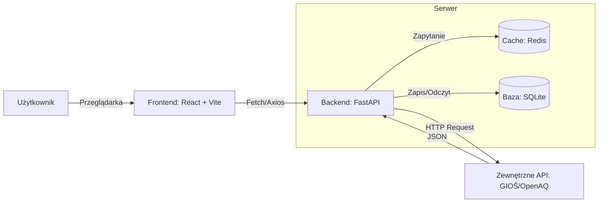

# 🌍 Monitor Jakości Powietrza (Grupa AA)
>[!IMPORTANT]
>### Projekt zespołowy mający na celu prezentowanie aktualnej jakości powietrza z API (GIOŚ/OpenAQ). 

***

 ## 🛠 Technologie:

|               |                         |
|:-------------:|:-----------------------:|
| Frontend      | `React + Vite`          | 
| Backend       | `FastAPI + Python`        | 
| Cache         | `Redis`                   |
| Baza danych   | `SQLite`                  | 
| Infrastruktura| `Docker & Docker Compose` | 
|               |                         |


>Backend działa jako serwer pośredniczący (proxy). Zgodnie z wymaganiami, przed zapytaniem do zewnętrznego API sprawdza dostępność danych w Cache (Redis) lub bazie (SQLite), aby zminimalizować liczbę zapytań i przyspieszyć czas odpowiedzi.

### 🚀 Jak uruchomić projekt lokalnie?
> [!NOTE]
>>Zgodnie z wymaganiem RNF-02, system można uruchomić za pomocą Dockera.

Wymagania wstępne:

**`Zainstalowany Docker Desktop oraz Git.`**


## Kroki:

### 1. Sklonuj repozytorium:
- ```bash
  git clone https://github.com/Thorvayne/Projet-Monitor-Jakosci-Powietrza.git
  ```
- ```bash
  cd Projet-Monitor-Jakosci-Powietrza
  ```
### 2. Uruchom kontenery:
- ```bash
  docker-compose up --build
  ```
### 3. Dostęp do aplikacji:
- Frontend: http://localhost:5173
- Backend API: http://localhost:8000
- Dokumentacja API (Swagger): http://localhost:8000/docs

## 📋 Role w zespole

| **Osoba**         | **Rola**             | **Technologia**                   |
|:-------------------:|:----------------------:|:-----------------------------------:|
| Karol Żyłuk         | Kierownik projektu     |  `Jira` , `Figma`                      |
| Wiktoria Młynarczyk | Frontend               | `React` , `Tailwind`                   |
| Krzysztof Kaczan    | Backend                | `FastAPI`, `Redis`, `SQLite`            |
| Jakub Kołodyński    | Analityk               | `Power BI`, `Pandas`                  |
| Hubert Przybylski   | Tech Lead / DevOps     | `Github`, `Docker`, `CI/CD`, `Cloud Run`  | 

## ⚙️ CI/CD (GitHub Actions)

### Każdy push na gałąź main lub develop uruchamia automatyczny proces:
1. Linting: ***Sprawdzenie poprawności i stylu kodu.***
2. Build: ***Testowe budowanie obrazów Dockerowych.***
